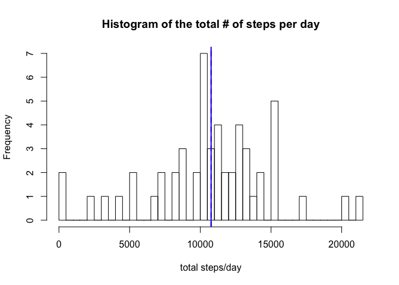
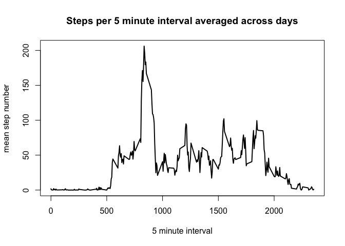
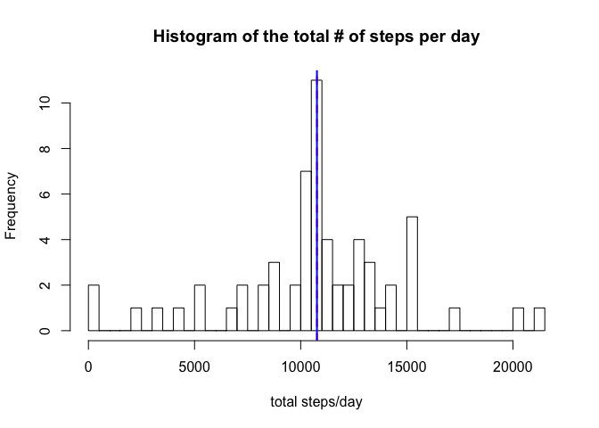
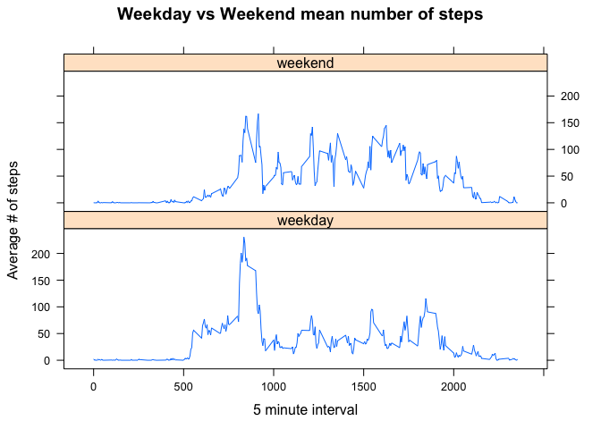

---
output:
  html_document: 
    keep_md: yes
  pdf_document: default
---
# Coursera Reproducible Research Assignment 1 (Molly Gordon)                                     


## Loading and preprocessing the data. Show any code that is needed to:
#### 1) Load the data (i.e. \color{red}{\verb|read.csv()|}read.csv())
#### 2) Process/transform the data (if necessary) into a format suitable for your analysis


```r
if (!file.exists("./data")) {
    dir.create("./data")
}
fileUrl <- "https://d396qusza40orc.cloudfront.net/repdata%2Fdata%2Factivity.zip"
download.file(fileUrl, destfile = "./data/DataSceince5.zip")

# Unzip the file
setwd("data/")
unzip("DataSceince5.zip")

activity <- read.csv(file = "activity.csv")
# Ensure that the class of the dates column is a date
activity$date <- as.Date(activity$date, format = "%Y-%m-%d")
```

## What is mean total number of steps taken per day?
#### 1) Calculate the total number of steps taken per day
#### 2) If you do not understand the difference between a histogram and a barplot, research the difference between them. Make a histogram of the total number of steps taken each day
#### 3) Calculate and report the mean and median of the total number of steps taken per day


```r
# Calculate the total number of steps taken per day
library(plyr)
total_steps <- ddply(activity, c("date"), summarise, sum = sum(steps))
# Remove NAs
total_steps <- total_steps[complete.cases(total_steps), ]

hist(total_steps$sum, breaks = 50, main = "Histogram of the total # of steps per day", 
    xlab = "total steps/day")
# Plot both the mean and median in red and blue lines, respectively
abline(v = mean(total_steps$sum), col = "red", lty = 2, lwd = 2)
abline(v = median(total_steps$sum), col = "blue", lty = 1, lwd = 2)
```

<!-- -->

```r
# Use the summary() function to determine values of mean and median. Note that
# they are very close, so the lines on the histogram appear to be overlapping.
summary(total_steps$sum)
```

```
##    Min. 1st Qu.  Median    Mean 3rd Qu.    Max. 
##      41    8841   10765   10766   13294   21194
```

## What is the average daily activity pattern?

#### 1) Make a time series plot (i.e. \color{red}{\verb|type = "l"|}type="l") of the 5-minute interval (x-axis) and the average number of steps taken, averaged across all days (y-axis)
#### 2) Which 5-minute interval, on average across all the days in the dataset, contains the maximum number of steps?


```r
activity <- activity[complete.cases(activity), ]
library(plyr)
average_steps <- ddply(activity, c("interval"), summarise, mean = mean(steps))
plot(average_steps, type = "l", main = "Steps per 5 minute interval averaged across days", 
    xlab = "5 minute interval", ylab = "mean step number", lwd = 2)
```

<!-- -->

```r
average_steps[which.max(average_steps$mean), ]
```

```
##     interval     mean
## 104      835 206.1698
```

```r
# The 835 minute interval has the maximum average number of steps/day at 206.2
# steps.
```

## Imputing missing values, Note that there are a number of days/intervals where there are missing values (coded as \color{red}{\verb|NA|}NA). The presence of missing days may introduce bias into some calculations or summaries of the data.

#### 1) Calculate and report the total number of missing values in the dataset (i.e. the total number of rows with \color{red}{\verb|NA|}NAs)
#### 2) Devise a strategy for filling in all of the missing values in the dataset. The strategy does not need to be sophisticated. For example, you could use the mean/median for that day, or the mean for that 5-minute interval, etc.
#### 3) Create a new dataset that is equal to the original dataset but with the missing data filled in.
#### 4) Make a histogram of the total number of steps taken each day and Calculate and report the mean and median total number of steps taken per day. Do these values differ from the estimates from the first part of the assignment? What is the impact of imputing missing data on the estimates of the total daily number of steps?


```r
activity <- read.csv(file = "activity.csv")
sum(is.na(activity$steps))  #2304 rows contain NA values in the activity dataframe. 
```

```
## [1] 2304
```

```r
activity2 <- activity  #newly named dataset to replace NAs

for (i in average_steps$interval) {
    
    activity2[activity2$interval == i & is.na(activity2$steps) == TRUE, ]$steps <- average_steps$mean[average_steps$interval == 
        i]
}


total_steps <- ddply(activity2, c("date"), summarise, sum = sum(steps))
hist(total_steps$sum, breaks = 50, main = "Histogram of the total # of steps per day", 
    xlab = "total steps/day")
# Plot both the mean and median in red and blue lines, respectively
abline(v = mean(total_steps$sum), col = "red", lty = 2, lwd = 2)
abline(v = median(total_steps$sum), col = "blue", lty = 1, lwd = 2)
```

<!-- -->

```r
# Use the summary() function to determine values of mean and median. Note that
# they are very close, so the lines on the histogram appear to be overlapping.
summary(total_steps$sum)
```

```
##    Min. 1st Qu.  Median    Mean 3rd Qu.    Max. 
##      41    9819   10766   10766   12811   21194
```

```r
# It appears that the mean has stayed the same in this case, but the median has
# increased slightly when I inputted the average number of steps per the time
# interval for the missing rows.
```

##Are there differences in activity patterns between weekdays and weekends?

#### 1) Create a new factor variable in the dataset with two levels – “weekday” and “weekend” indicating whether a given date is a weekday or weekend day.
#### 2) Make a panel plot containing a time series plot (i.e. \color{red}{\verb|type = "l"|}type="l") of the 5-minute interval (x-axis) and the average number of steps taken, averaged across all weekday days or weekend days (y-axis). See the README file in the GitHub repository to see an example of what this plot should look like using simulated data.


```r
activity2$date <- as.Date(activity2$date, format = "%Y-%m-%d")
activity2$weekdays <- weekdays(activity2$date)  #add a column with weekdays 
weekday <- c("Monday", "Tuesday", "Wednesday", "Thursday", "Friday")
weekend <- c("Saturday", "Sunday")

for (i in weekday) {
    activity2[activity2$weekdays == i, ]$weekdays <- "weekday"
}

for (i in weekend) {
    activity2[activity2$weekdays == i, ]$weekdays <- "weekend"
}

average_steps <- ddply(activity2, c("interval", "weekdays"), summarise, mean = mean(steps))

library(lattice)
xyplot(mean ~ interval | weekdays, data = average_steps, type = "l", layout = c(1, 
    2), ylab = "Average # of steps", xlab = "5 minute interval", main = "Weekday vs Weekend mean number of steps")
```

<!-- -->
